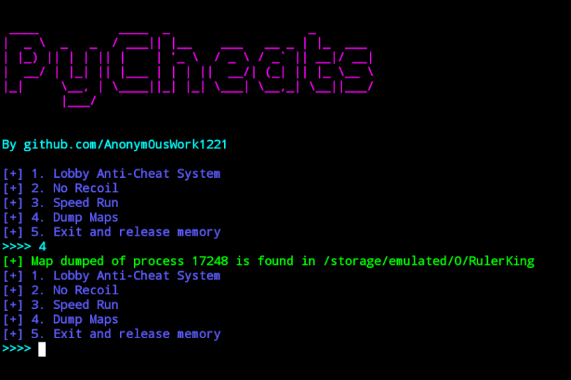

PyCheats - An Ultimate Android Cheat Script
====
[](https://github.com/Anonym0usWork1221/Android-Py-Cheats-Script/stargazers)
[](https://github.com/Anonym0usWork1221/Android-Py-Cheats-Script/network/members)
[](https://github.com/Anonym0usWork1221/Android-Py-Cheats-Script/issues)
[](https://github.com/Anonym0usWork1221/Android-Py-Cheats-Script/watchers)
[](https://www.python.org)
[](https://opensource.org/licenses/)

-----------
**This is an example of using androidMemoryTool on android**

If you find any bug or not working function you can contact me. 

 *  date   : 2023/10/13
 *  Version : 0.3
 *  author : Abdul Moez (abdulmoez123456789@gmail.com)
 *  Study  : UnderGraduate in GCU Lahore, Pakistan

 MIT License

 Copyright (c) 2022 AbdulMoez

## Introduction
**_PyCheats_** is a Python-based Android game cheating tool designed to help you modify 
and manipulate game values for **Android games**. This tool allows you to bypass 
**anti-cheat** systems, **activate basic game cheats**, and perform various actions to 
gain an advantage in your favorite Android games. This documentation provides 
detailed information for both developers and simple users.

--------
That's it! You can now use PyCheats to enhance your gaming experience and gain an advantage in your 
favorite Android games. Enjoy cheating responsibly!
---------
LOGS

    -----------------------------------------MODIFICATION LOG--------------------------------------------------
    1. Introducing an enhanced group search system and a streamlined tool arrangement for improved efficiency.
    2. Replacing the outdated search system with a cutting-edge, advanced alternative.
    3. Version 0.3 offers compatibility with androidMemoryTool version 0.6.3 or higher.

------
Requirements
-----------
* Python Version >= 3.7
* Rooted Environment needed.

Compatible
-----------
* This script is made for an example the target packaged used in script was (com.tencent.ig)(PUBG MOBILE)
* For other games just change the addresses or values.
* This script uses ASYNC to boost work speed.

Installation
----------------------------------------
* **__Manual Installation__**
  1. First fulfill python requirements ``pip3 install -r ./requirements.txt``
  2. Second run script as root ``sudo python3 PyCheats.py``

* **__Auto Installation__**
  1. Simply run ``python3 PyCheats.py`` it will automatically install all requirements**

Video Demonstration
----------------------------------------
[](https://www.youtube.com/watch?v=XgKjv0k_8pQ)

Old Versions
----------------------------------------
**Old versions can be found in packages section**


OutPut Sample
-----------
<br>
<p align="center">
  
</p>

-----

## Simple User Documentation
### Requirements
As a simple user, **you don't need to install** the required packages manually. 
These packages are automatically installed when you run the PyCheats tool.

### Using PyCheats
To use `PyCheats` as a simple user, follow these steps:
1. Run the `PyCheats.py` script. This will start the PyCheats tool and display the 
   controller menu.
2. Use the controller menu to perform various actions, including logo bypass, 
   lobby bypass, and activating basic cheats.
3. Follow the on-screen instructions to interact with the `PyCheats tool`.

### Important Notes
**Make sure to run the PyCheats** tool as a `superuser (root)` if required to access certain Android game memory.
PyCheats may not work with all Android games and may require specific game package information.

### Version
The current version of PyCheats support androidMemoryTool Version  0.6.3. 
Make sure to use this version when installing the tool.

-----
## Developer Documentation
### Requirements
Before using PyCheats, make sure to install the required Python packages 
listed in the `requirements.txt` file. You can install these packages 
using the following command:
```shell
pip install -r requirements.txt
```

### Main File: PyCheats.py
The `PyCheats.py` file is the main script that controls the PyCheats tool. 
It includes classes and methods for interacting with Android games, 
bypassing **anti-cheat systems**, and **activating cheats**.

### Installation and Usage
To use PyCheats, follow these steps:
1. Create a Python virtual environment and install the required packages using the `requirements.txt` file.
2. Run the `PyCheats.py` script. This will start the PyCheats tool and display the controller menu.
3. Use the controller menu to perform various actions, including logo bypass, lobby bypass, and activating basic cheats.

### Classes and Methods
The main classes and methods in `PyCheats.py` are as follows:
* **_PyCheats_**: The main class that initializes the PyCheats tool and provides methods for various actions.
   * `__init__()`: Initialize the PyCheats object.
   * `__async__get_ticks()`: Asynchronously get information about the Android game and initialize instances.
   * `_initialize_instances()`: Initialize memory tool instances for various memory ranges and data types.
   * `logo_bypass()`: Perform a logo bypass to modify game values.
   * `lobby_bypass()`: Perform a lobby bypass to remove unnecessary files and modify game values.
   * `basic_cheats()`: Activate basic game cheats based on the specified cheat code.
   * `controller_menu()`: Display a controller menu to interact with the PyCheats tool.
   * `get_ticks()`: Start the PyCheats tool and enter the event loop to interact with the controller menu.

> Configuration: Ensure that the `requirements.txt` file includes the necessary packages. 
You can specify the desired package versions in this file.

### Utility Classes
`PyCheats` also includes utility classes for various tasks. 
These utility classes are used within the main script.
1. `RootUtils (root_utilities.py)`:
   This utility class handles root-related tasks and interactions with 
   Android applications. It provides methods for checking if a game is running, 
   acquiring root privileges, and removing files.
   * `is_game_running()`: Check if an Android game with the specified package name is currently running.
   * `is_rooted_acquired()`: Check if the script has acquired root privileges, and if not, attempt to acquire them.
   * `remove_file()`: Remove a file at the specified path if it exists.

2. `PPrints (pprints.py)`:
    This utility class is responsible for pretty-printing colored text messages in the terminal. 
    It provides methods for displaying decorative headers and printing messages with different information 
    types and text colors.
    * `decoration()`: Display a decorative header with the project name and author information.
    * `pprints()`: Pretty print a text message with optional formatting options.

3. `GameInformationHandler (gather_information.py)`:
   This class manages game information, allowing you to compare, retrieve, and update game package information. 
   It is particularly useful for managing Android game package data.
   * `compare()`: Compare the current game package name with a stored one.
   * `get_data()`: Prompt the user to enter a game package name and store it in a JSON file.
   * `unpack_information()`: Retrieve the stored game package name.

4. `ReqInstaller (requirements_installer.py)`:
   This class manages the installation of required dependencies for the Python script. It checks for the availability 
   of required packages and installs them if necessary.
   * `install_requirements()`: Installs required Python packages based on script's import availability 
                             and superuser status.


     
# Contributor

<a href = "https://github.com/Anonym0usWork1221/Android-Py-Cheats-Script/graphs/contributors">
  
</a>


Assistance
----------
If you need assistance, you can ask for help on my mailing list:
* Email      : abdulmoez123456789@gmail.com

I also created a Discord group:
* Server     : https://discord.gg/RMNcqzmt9f


Buy Me a coffee
--------------
If you want to support me you can buy me coffee.

* Payoneer: ```abdulmoez123456789@gmail.com```  
* BitCoin_addr: ``` 19vwfRXfthPY7f2aqDBpxQvZa6AJFKcdBS ```

